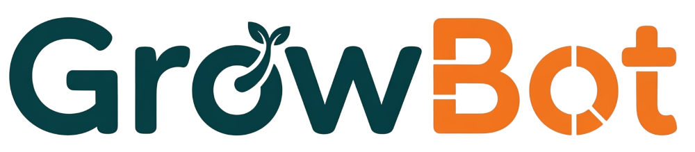
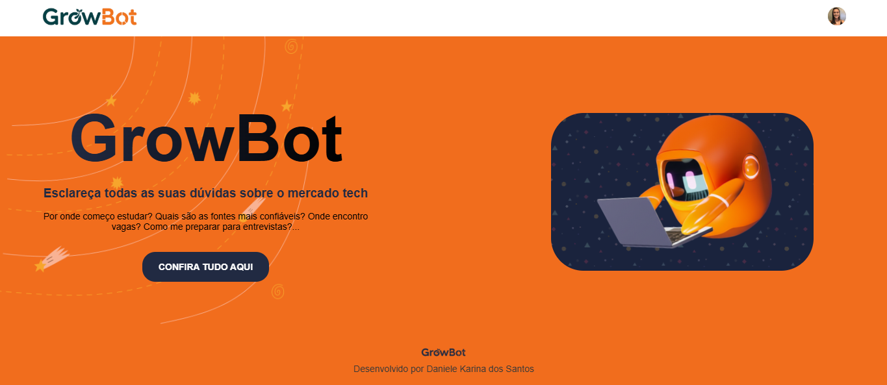
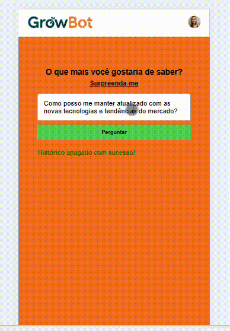

## Sobre o Projeto

O **GrowBot** é um assistente virtual inteligente projetado para guiar pessoas iniciantes e aspirantes na jornada do mercado de tecnologia. Desenvolvido para responder a dúvidas comuns de forma rápida e precisa, o GrowBot utiliza o poder da inteligência artificial para fornecer insights sobre como iniciar uma carreira, quais tecnologias estudar, onde encontrar oportunidades de emprego e muito mais.

Este projeto visa simplificar o processo de busca por informações, centralizando o conhecimento em uma interface de chat amigável e acessível. A conversa é fluida e intuitiva, proporcionando uma experiência de usuário eficiente e agradável.

## Tecnologias Utilizadas

O GrowBot foi construído com um conjunto de tecnologias modernas e robustas, garantindo uma aplicação escalável, responsiva e segura.

-   **Frontend**:
    
    -   **React**: Biblioteca JavaScript para construção da interface de usuário.
        
    -   **React Router**: Gerenciamento de rotas e navegação.
        
    -   **CSS**: Estilização e design responsivo.
        
    -   **Clerk**: Serviço de autenticação para gerenciar usuários.
        
-   **Backend**:
    
    -   **Node.js**: Ambiente de execução para o servidor.
        
    -   **Express**: Framework web para construir a API.
        
    -   **Google Gemini API**: Modelo de linguagem de IA para as respostas do chatbot.
        
    -   **MongoDB**: Banco de dados NoSQL para armazenamento de histórico de chat.
        
-   **Deployment**:
    
    -   **Vercel**: Plataforma para implantação do frontend.
        
    -   **Render**: Plataforma para implantação do backend.
        

## Recursos (Features)

-   **Chat em Tempo Real**: Interação fluida e instantânea com o chatbot.
    
-   **Design Responsivo Otimizado para Mobile**: Layout adaptável que garante uma experiência de uso perfeita em dispositivos móveis, tablet e desktop.
    
-   **Respostas Otimizadas por IA**: O modelo de IA é configurado com um contexto específico para o mercado de tecnologia, garantindo respostas precisas e contextualizadas, otimizadas para o público iniciante.
    
-   **Histórico de Conversa**: As conversas são salvas no banco de dados para que os usuários possam acessá-las a qualquer momento.
    
-   **Autenticação de Usuário**: Acesso seguro com autenticação de login/registro gerenciada pelo Clerk.
    
-   **Interface Intuitiva**: Design moderno e fácil de usar.
    
-   **Botão 'Surpreenda-me'**: Opção de gerar perguntas aleatórias para explorar tópicos diversos.
    

## Histórico de Desenvolvimento

O projeto foi construído de forma incremental, com cada versão adicionando e refinando novas funcionalidades:

-   **v.1 - Chat Funcional**: Implementação do chat básico, permitindo a comunicação inicial entre o usuário e o bot.
    
-   **v.2 - Autenticação**: Adição de um sistema de autenticação para gerenciar usuários e garantir o histórico de conversas individual.
    
-   **v.3 - Persistência de Histórico**: Integração com **MongoDB** para salvar o histórico de mensagens, permitindo que os usuários continuem suas conversas.
    
-   **v.4 - Feedback Visual**: Inclusão de um indicador de carregamento para informar ao usuário que a IA está processando a resposta.
    
-   **Merge na `main`**: A versão final (v.4) foi mesclada na branch `main`, incorporando refinamentos e melhorias significativas de UX/UI, resultando em um layout mais agradável, responsivo e acessível.

## 🎨 Preview da Aplicação




## Acessando e Testando a Aplicação em Produção

Você pode acessar e testar a versão mais recente do GrowBot diretamente na URL de produção:
📎 [https://grow-bot.vercel.app/](https://grow-bot.vercel.app/ )

## Como Rodar o Projeto

Siga estes passos para configurar e executar o projeto em seu ambiente local.

### Pré-requisitos

Certifique-se de que você tenha o Node.js e o npm (ou Yarn) instalados em sua máquina.

### Configuração

1.  Clone o repositório:
    
    ```Bash
    git clone https://github.com/danieleksantos/GrowBot.git
    cd GrowBot
    ```
    
2.  Instale as dependências:
    
    ```Bash
    npm install
    ```
    
3.  Configure as variáveis de ambiente. Crie um arquivo `.env.local` na raiz do projeto com as seguintes variáveis:
    
    ```Bash
    REACT_APP_GEMINI_API_KEY="SUA_CHAVE_DE_API_GEMINI"
    REACT_APP_CLERK_PUBLISHABLE_KEY="SUA_CHAVE_PUBLICAVEL_CLERK"
    REACT_APP_CLERK_SECRET_KEY="SUA_CHAVE_SECRETA_CLERK"
    ```
    
4.  Execute o projeto:
    ```Bash
    npm start
    ```
    
    O aplicativo será executado em [http://localhost:3000](https://www.google.com/search?q=http://localhost:3000 "null").
    

## Estrutura do Projeto

```
Directory structure:
└── danieleksantos/GrowBot/
	└── README.md
	└── db.js
	└── eslint.config.js
	└── index.html
	├── models
		└── Message.js
	└── nodemon.json
	└── package-lock.json
	└── package.json
	├── public
	├── src
		├── assets
		├── components
		│   ├── chatHistory
			    └── ChatHistory.jsx
			    └── chatHistory.css
		    ├── chatInput
			    └── ChatInput.jsx
			    └── chatInput.css
		├── layouts
		│   ├── rootLayout
			    └── RootLayout.jsx
			    └── rootLayout.css
		└── main.jsx
		├── routes
		│   ├── chatPage
			    └── ChatPage.jsx
			    └── chatPage.css
		    ├── homepage
			    └── Homepage.jsx
			    └── homepage.css
		    ├── signInPage
			    └── SignInpage.jsx
			    └── signInPage.css
		    ├── signUpPage
			    └── SignUpPage.jsx
			    └── signUpPage.css
		├── services
		    └── api.js
		└── vercel.json
		└── vite.config.js


```

## Contribuição

Contribuições são bem-vindas! Se você encontrar um bug, tiver uma sugestão de melhoria ou quiser adicionar um novo recurso, sinta-se à vontade para abrir uma _issue_ ou enviar um _pull request_.
<br>
<br>
<br>


Desenvolvido por **Daniele Karina dos Santos**.
